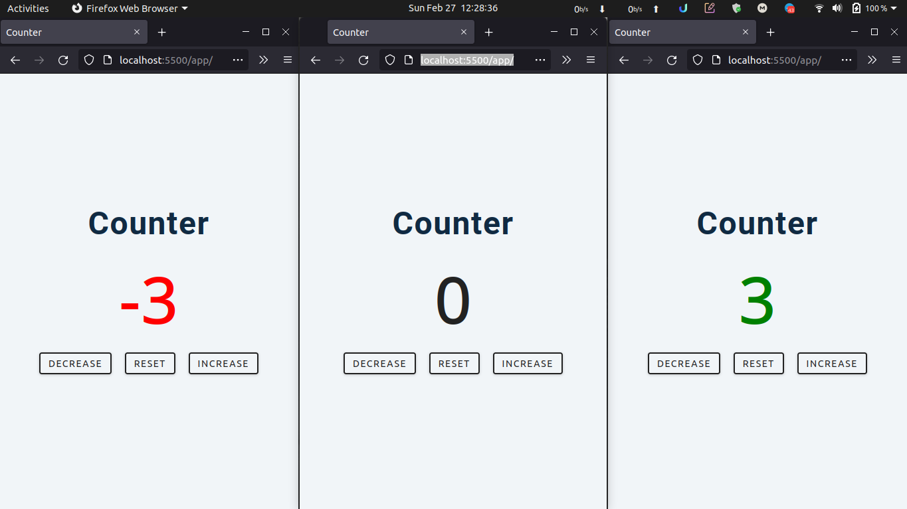

# Counter

## Description

Simple counter that lets the user change its value by clicking one of the buttons.

## Schreenshot

## Credits

The original project can be found at [Build 15 JavaScript Projects - Vanilla JavaScript Course](https://www.youtube.com/watch?v=3PHXvlpOkf4&t=1825s)
